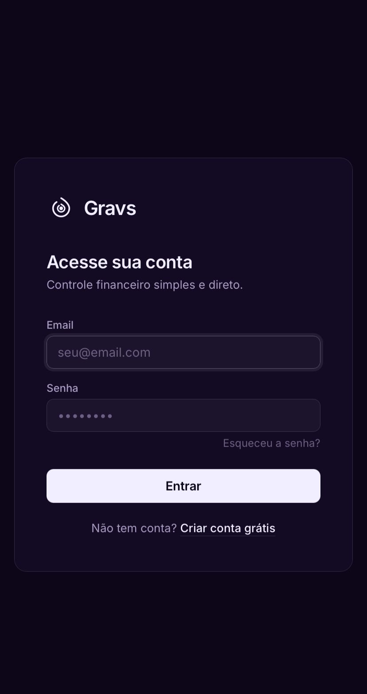
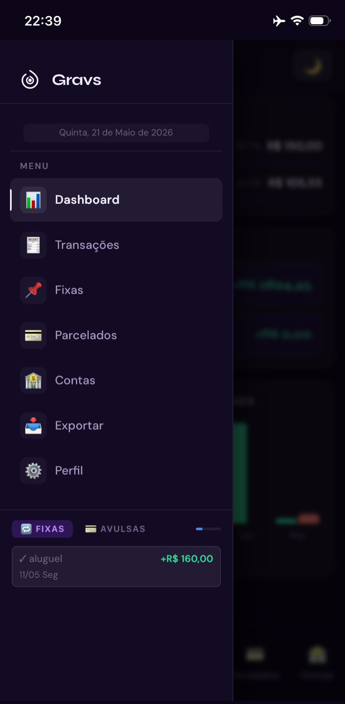
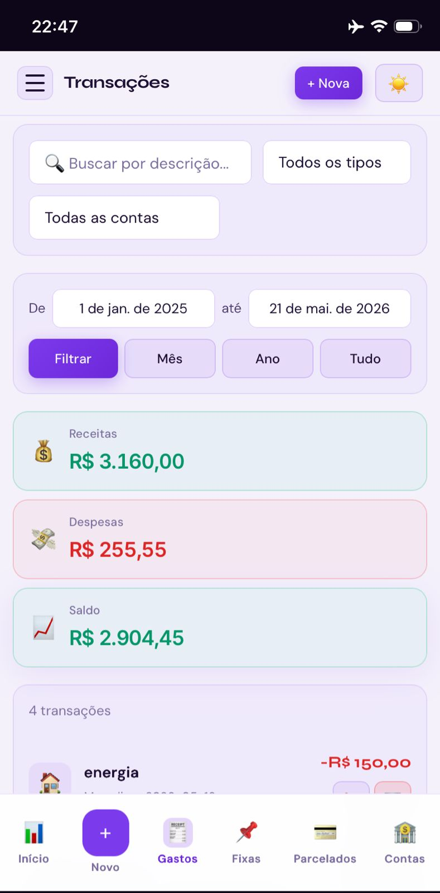
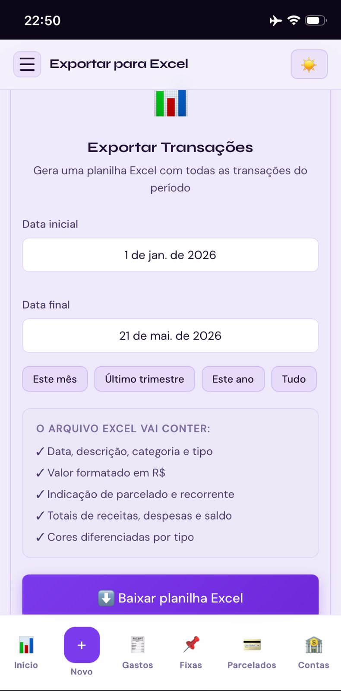

<div align="center">

  

  # 🌀 Gravs — Controle Financeiro Pessoal

  > *"Você sabe quanto ganhou esse mês. Mas sabe onde foi parar cada centavo?"*

  
  
  
  
  

</div>

---

## 💡 Motivação

A maioria das pessoas chega ao fim do mês sem entender onde o dinheiro foi parar. Salário entrou, contas saíram, e sobrou menos do que deveria. O **Gravs** foi criado para mudar isso — dar visibilidade total sobre receitas, despesas, contas fixas e parcelamentos de forma simples e visual, no celular ou no computador.

---

## 📸 Preview

### Login


### Dashboard


<details>
<summary>Ver mais screenshots</summary>

### Menu e Navegação


### Transações


### Exportar para Excel


</details>

---

## ✨ Funcionalidades

### Controle completo
- **Transações avulsas** — registre receitas e despesas com categoria, data e conta bancária
- **Contas fixas** — cadastre salário, aluguel, assinaturas e receba lembretes automáticos de vencimento
- **Compras parceladas** — acompanhe o progresso de cada parcelamento com barra visual
- **Contas bancárias e cartões** — saiba de qual conta saiu cada gasto
- **Importação de extrato CSV** — importe o extrato do Bradesco e o app classifica automaticamente cada lançamento (receita/despesa/categoria), com tela de revisão antes de confirmar

### Dashboard inteligente
- **Hero com saldo do mês** e comparação percentual com o mês anterior
- **3 cards harmônicos** — Receitas, Despesas e Taxa de Poupança com meta de 30% e indicador de meta atingida
- **Gastos por categoria** com barras de progresso e limites configuráveis por categoria
- **Saldo por conta bancária** atualizado em tempo real
- **Próximos vencimentos** — contas fixas que vencem nos próximos 10 dias
- **Dicas automáticas** geradas com base nos seus dados reais do mês
- **Últimas transações** do mês com ícone e categoria
- **Evolução dos últimos 6 meses** com gráfico de barras interativo

### Busca e filtros
- Busca em tempo real por descrição
- Filtro por tipo (receita/despesa) e por conta bancária
- Filtro por período com atalhos (mês, trimestre, ano)

### Exportação e contabilidade
- Exportar transações para Excel com totais e cores
- Modo contábil com lançamentos em partida dobrada (débito/crédito)

### Segurança
- **Proteção CSRF** em todos os formulários e chamadas fetch/AJAX (Flask-WTF)
- **Rate limiting** no login — 5 tentativas por minuto por IP
- **Hash bcrypt** nas senhas via Werkzeug
- **Isolamento total por usuario_id** — cada usuário vê só os próprios dados
- **Headers de segurança HTTP** em todas as respostas
- **Cookies seguros** em produção (HttpOnly, SameSite, Secure)
- **SQL 100% parametrizado** — sem SQL injection
- **Logs de auditoria** em ações sensíveis (login, exclusão de conta, mudança de senha)

### Conta e LGPD
- **Verificação de email** por código de 6 dígitos no cadastro (expira em 15 minutos)
- **Aceite obrigatório dos Termos de Uso** no cadastro
- **Política de Privacidade** em conformidade com a LGPD
- **Exclusão de conta** com confirmação de senha e anonimização do email (direito ao esquecimento)
- **Reuso de email** — após excluir a conta, o mesmo email pode ser usado para criar uma nova
- Recuperação de senha por email com token de expiração de 1 hora

### Experiência
- Tema claro e escuro com um clique
- Totalmente responsivo — funciona igual no celular e no computador
- Instalável como app (PWA) na tela inicial do celular
- Favicon e ícone do app em todas as abas do browser
- Widget na sidebar com resumo de fixas e lançamentos recentes

---

## 🛠 Tecnologias

| Camada | Tecnologia |
|--------|-----------|
| Backend | Python 3.11+ + Flask 3.x |
| Autenticação | Flask-Login + Werkzeug (bcrypt) |
| Segurança | Flask-WTF (CSRF) + Flask-Limiter |
| Banco de dados | SQLite com WAL mode + índices otimizados |
| Frontend | HTML5 + CSS3 + JavaScript puro |
| Tipografia | Inter + Syne (Google Fonts) |
| Excel | openpyxl |
| Email | Gmail SMTP (verificação + recuperação de senha) |
| Testes | pytest — 170 testes automatizados |
| Deploy | PythonAnywhere |

---

## 🏗 Arquitetura

```
gravs/
├── app.py                    # Application Factory (create_app)
├── config.py                 # Configurações por ambiente (dev/test/prod)
├── wsgi.py                   # Entry point para produção
│
├── database/
│   ├── manager.py            # Gerenciador SQLite + migrations automáticas
│   └── repositories.py       # Repositórios de dados — padrão Repository
│
├── services/
│   ├── container.py          # Service Container (injeção de dependência)
│   ├── auth_service.py       # Autenticação e registro
│   ├── transacao_service.py  # Lógica de transações e parcelamentos
│   ├── recorrente_service.py # Lógica de contas fixas e lembretes
│   ├── dashboard_service.py  # Agregação de dados para o dashboard
│   └── email_service.py      # Envio de emails
│
├── routes/                   # Blueprints Flask por domínio
│   ├── auth.py               # Login, cadastro, verificação de email
│   ├── dashboard.py          # Dashboard e APIs de dados
│   ├── transacoes.py         # CRUD de transações
│   ├── recorrentes.py        # Contas fixas
│   ├── importacao.py         # Importação de extrato CSV (Bradesco)
│   ├── perfil.py             # Perfil, senha, exclusão de conta
│   ├── publico.py            # Termos de uso e política de privacidade
│   └── ...
│
├── templates/                # Jinja2 — mobile-first
│   ├── base.html             # Layout base com CSRF global e tema
│   ├── auth/                 # Login, cadastro, verificação de email
│   ├── dashboard/            # Dashboard com layout de duas colunas
│   ├── importacao/           # Upload e revisão de CSV
│   └── publico/              # Termos e privacidade
│
├── static/                   # Ícones PWA + favicon + manifest.json
├── utils/                    # Formatadores, validadores, calendário BR
└── tests/                    # 170 testes automatizados
```

**Padrões adotados:** Application Factory · Repository Pattern · Service Container · Blueprints · Soft Delete · Migrations automáticas · CSRF global via interceptor JS

---

## 🚀 Rodando localmente

```bash
git clone https://github.com/gabrielmarques-tech/gravs.git
cd gravs
pip install -r requirements.txt
cp .env.secret.example .env.secret
# Edite o .env.secret com seus valores

# Windows
set FLASK_ENV=development
flask --app app run --debug

# Linux/Mac
FLASK_ENV=development flask --app app run --debug
```

Acesse `http://127.0.0.1:5000`

> **Nota:** sem `EMAIL_REMETENTE` configurado, o app funciona normalmente em desenvolvimento — a verificação de email é automática e o código aparece no log do terminal.

---

## 🧪 Testes

```bash
python -m pytest tests/ -v
```

**170 testes** cobrindo autenticação, verificação de email, LGPD, transações, parcelamentos, recorrentes, importação CSV, exclusão de conta, migrations, dashboard e APIs.

---

## ⚙️ Variáveis de ambiente

| Variável | Descrição |
|----------|-----------|
| `SECRET_KEY` | Chave secreta do Flask (obrigatório em produção) |
| `DATABASE_URL` | Caminho do banco SQLite |
| `EMAIL_REMETENTE` | Gmail para envio de emails |
| `EMAIL_SENHA_APP` | Senha de app do Google |
| `FLASK_ENV` | `development`, `testing` ou `production` |

Consulte `.env.secret.example` para o modelo completo.

---

## 📧 Configurar email (Gmail)

1. Acesse [myaccount.google.com/apppasswords](https://myaccount.google.com/apppasswords)
2. Crie uma senha de app para "Gravs"
3. Adicione no `.env.secret`:

```
EMAIL_REMETENTE=seu@gmail.com
EMAIL_SENHA_APP=xxxx xxxx xxxx xxxx
```

Usado para verificação de conta, recuperação de senha e resumo mensal (dia 28).

---

<div align="center">
  <sub>Feito com dedicação para quem quer saber para onde o dinheiro vai.</sub>
</div>
