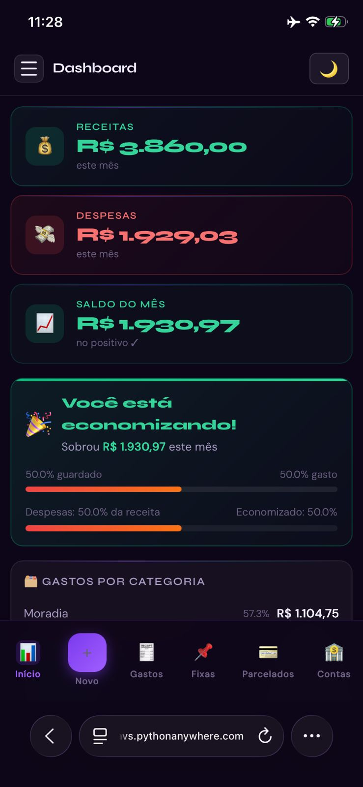
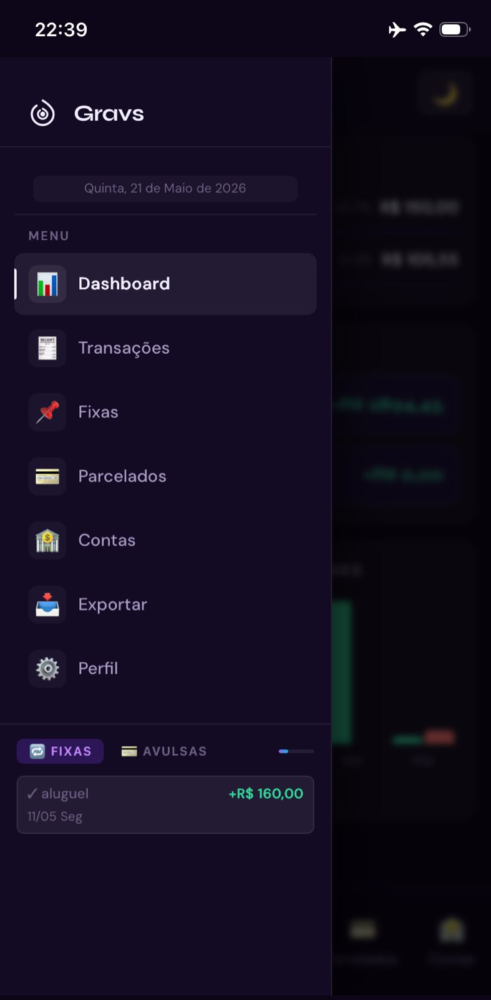
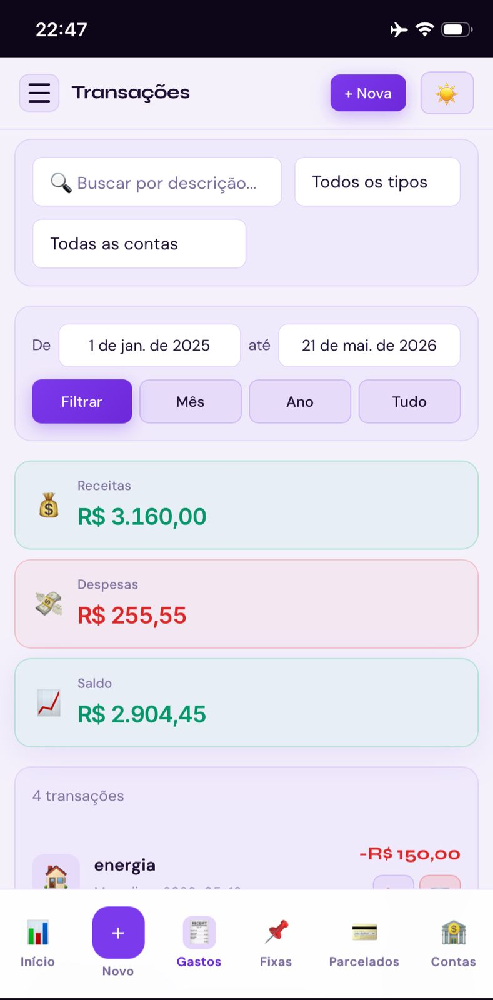
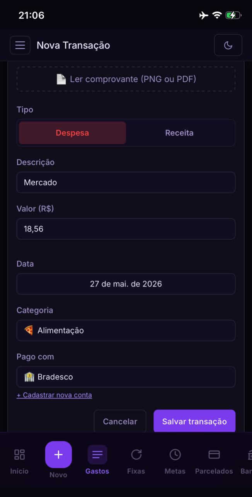

  

  # Gravs

  **Controle financeiro pessoal — simples, rápido, seu.**

  
  
  
  
  
  

---

A maioria das pessoas termina o mês sem saber onde o dinheiro foi parar. O Gravs resolve isso — visibilidade total sobre receitas, despesas, contas fixas, parcelamentos, metas e transferências, em uma interface limpa e responsiva.

Com suporte a **partidas dobradas** (modo contábil), você pode evoluir de um simples extrato financeiro para uma contabilidade pessoal completa.

---

## Screenshots

### Dashboard

### Menu lateral

### Transações

### Nova transação

### Login

---

## Funcionalidades

### Transações
- Registre **receitas e despesas** com categoria, conta e data
- **Parcelamentos** — distribui automaticamente nos meses corretos, com ou sem juros
- Suporta Sistema Price (tabela SAC), juros simples e sem juros
- **Transação rápida** — registro em um clique direto da tela inicial
- **Busca e filtros** em tempo real por tipo, conta, termo e período
- **Soft-delete** — transações deletadas podem ser restauradas
- Paginação de 50 itens por página com navegação entre páginas

### Contas fixas e recorrentes
- Cadastre salário, aluguel, assinaturas com **geração automática de lançamentos**
- Suporte a **dias úteis** (dia -1 = primeiro dia útil do mês)
- Confirme pagamentos ou edite valores diretamente na lista
- Widget na sidebar com fixas do mês e status de pagamento

### Transferências entre contas
- Mova saldo sem criar despesa duplicada
- Pague fatura de cartão registrando como transferência (corrente → cartão)
- Funciona com múltiplos cartões e contas

### Cartão de crédito
- Modelagem correta: cartão é **passivo**, não ativo
- Compra no cartão → aumenta a dívida (passivo)
- Pagamento da fatura → reduz a dívida e diminui o saldo da conta
- Sem dupla contagem de despesas

### Metas financeiras
- Defina objetivos com valor alvo e prazo
- Acompanhe o progresso com barra visual
- Widget no dashboard mostra as metas ativas

### Dashboard
- Saldo do mês com comparação ao mês anterior
- Cards de Receitas, Despesas e **Taxa de Poupança** (meta: 30%)
- Gastos por categoria com barras e **limites configuráveis**
- Saldo por conta considerando transferências
- Próximos vencimentos de contas fixas
- Gráfico de evolução dos últimos 6 meses
- Dicas automáticas baseadas nos dados reais

### Importação CSV
- Upload do extrato bancário em CSV (formato Bradesco e similares)
- Classifica automaticamente PIX recebido → Receita PIX
- PIX enviado e QR Code → Transferências PIX
- Revisão antes de confirmar a importação

### Exportação Excel
- Planilha completa com cores por tipo (receita/despesa)
- Filtro por período com atalhos (este mês, trimestre, ano, tudo)
- Totais de receitas, despesas e saldo no rodapé

### Modo contábil (partidas dobradas)
- **Lançamentos em partida dobrada** (débito/crédito) — ative nas configurações de perfil
- Plano de Contas hierárquico (5 níveis) com tipos: ativo, passivo, PL, receita, despesa, redutora
- Lançamento atômico: transação financeira + lançamento contábil em uma única transação SQL
- Exportação separada do livro contábil
- Acesso restrito — ative nas configurações de perfil

  **Exemplos de partidas:**
  | Operação | Débito | Crédito |
  |---|---|---|
  | Receita (salário) | Conta Financeira (Ativo) | Receita (Resultado) |
  | Despesa (alimentação) | Despesa (Resultado) | Conta Financeira (Ativo) |
  | Transferência | Conta Destino (Ativo) | Conta Origem (Ativo) |
  | Compra no cartão | Despesa (Resultado) | Passivo Cartão (Passivo) |
  | Pagamento de fatura | Passivo Cartão (Passivo) | Banco (Ativo) |
  | Investimento | Investimento (Ativo) | Banco (Ativo) |

### Segurança
- CSRF em todos os formulários e chamadas AJAX
- HSTS, CSP, X-Frame-Options, Referrer-Policy, Permissions-Policy
- Rate limiting no login — 5 tentativas por minuto por IP
- Senhas com hash bcrypt (Werkzeug)
- Isolamento total por `usuario_id` em todas as queries
- Logs de auditoria com emails anonimizados
- `ON DELETE RESTRICT` nas FKs contábeis — impede exclusão de contas com movimentação

### Conta e LGPD
- Verificação de email por código de 6 dígitos (expira em 15 min)
- Aceite obrigatório dos Termos de Uso no cadastro
- Recuperação de senha por email com token de 1 hora
- Exclusão de conta com anonimização de email (direito ao esquecimento)
- Dados preservados em soft-delete — recuperação judicial possível

### UX e acessibilidade
- Tema claro e escuro com persistência entre sessões
- **PWA** — instalável no celular como app nativo
- Bottom navigation no mobile
- Skip link para navegação por teclado
- Atalhos de teclado: `N` nova transação · `B` busca · `G` dashboard · `?` ajuda
- Filtros de transações persistentes via sessionStorage
- Modal de confirmação próprio (sem `window.confirm()` nativo)
- Resumo mensal por email automático todo dia 28

---

## Stack

| Camada | Tecnologia |
|--------|-----------|
| Backend | Python 3.11+ · Flask 3.x |
| Autenticação | Flask-Login · Werkzeug bcrypt |
| Segurança | Flask-WTF (CSRF) · Flask-Limiter |
| Performance | Flask-Compress (gzip) · SQLite WAL · índices compostos · mmap 128MB |
| Banco | SQLite com cache 8MB · temp_store MEMORY · WAL mode |
| Frontend | HTML5 · CSS3 · JavaScript puro — sem frameworks |
| Design | Inter (Google Fonts) · design tokens CSS · tema claro/escuro |
| Excel | openpyxl |
| Email | SMTP (Gmail) · APScheduler (agendador) |
| Testes | pytest — 495+ testes automatizados |
| Deploy | PythonAnywhere · Gunicorn |

---

## Arquitetura

