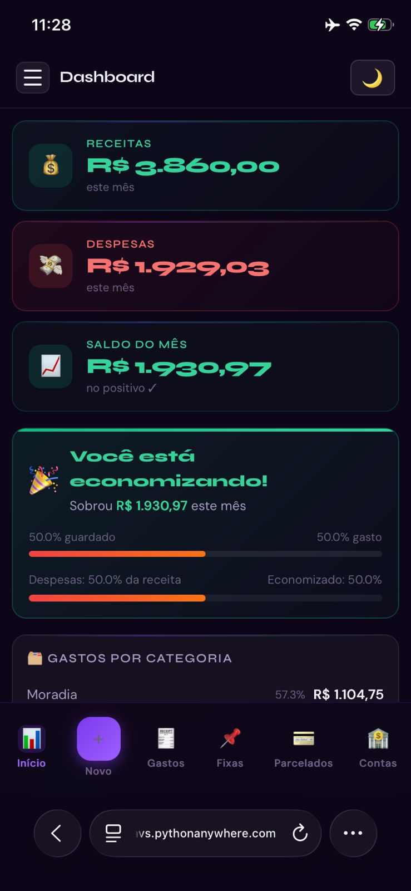
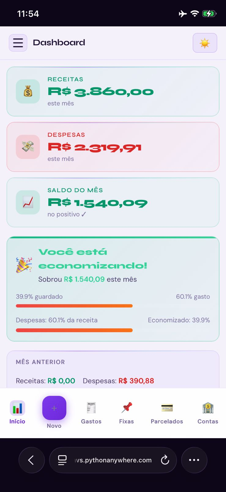
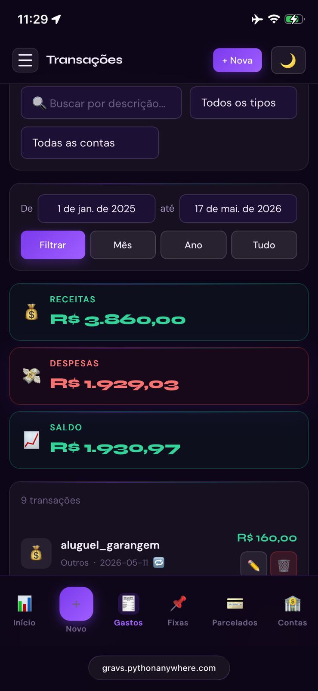
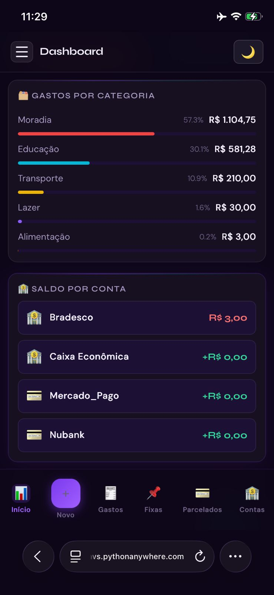
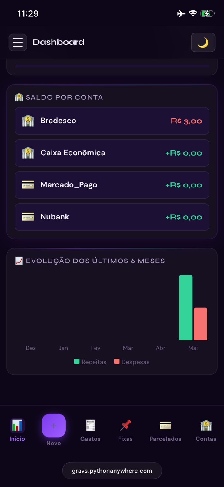
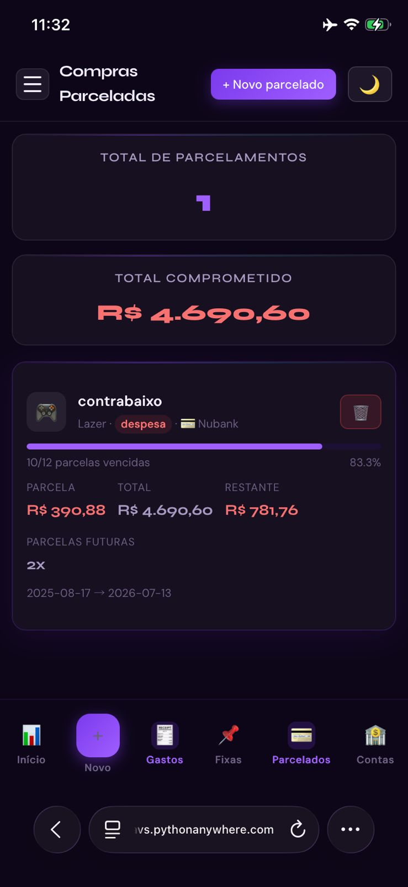
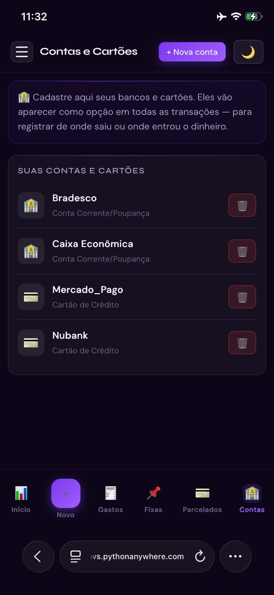
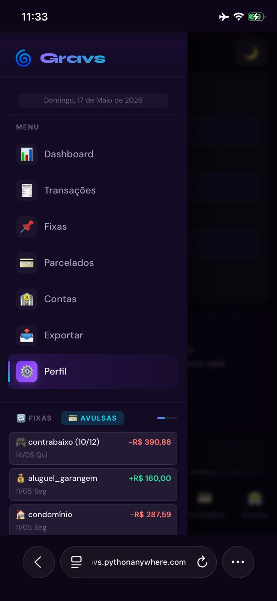
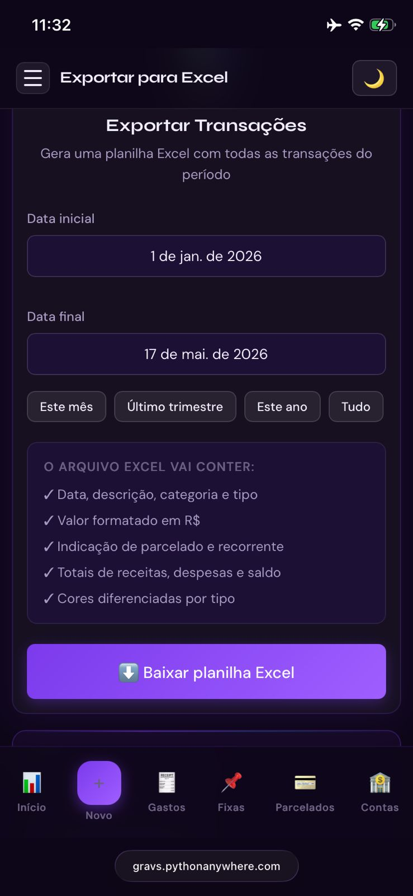
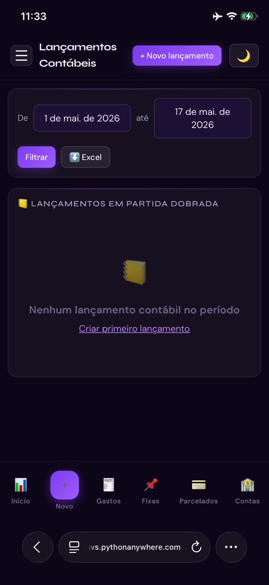

<div align="center">

  

  # 🌀 Gravs — Controle Financeiro Pessoal

  > *"Você sabe quanto ganhou esse mês. Mas sabe onde foi parar cada centavo?"*

  
  
  
  
  

</div>

---

## 💡 Motivação

A maioria das pessoas chega ao fim do mês sem entender onde o dinheiro foi parar. Salário entrou, contas saíram, e sobrou menos do que deveria. O **Gravs** foi criado para mudar isso — dar visibilidade total sobre receitas, despesas, contas fixas e parcelamentos de forma simples e visual, no celular ou no computador.

---

## 📸 Preview

### Dashboard


### Tema Claro


### Transações e Busca


<details>
<summary>Ver mais screenshots</summary>

### Dashboard — Visões alternativas



### Parcelados


### Contas e Cartões


### Widget de Informações


### Exportar para Excel


### Modo Contábil


</details>

---

## ✨ Funcionalidades

### Controle completo
- **Transações avulsas** — registre receitas e despesas com categoria, data e conta bancária
- **Contas fixas** — cadastre salário, aluguel, assinaturas e receba lembretes automáticos de vencimento
- **Compras parceladas** — acompanhe o progresso de cada parcelamento com barra visual
- **Contas bancárias e cartões** — saiba de qual conta saiu cada gasto

### Dashboard inteligente
- Resumo do mês: receitas, despesas e saldo
- Card de economia com percentual guardado
- Gráfico de evolução dos últimos 6 meses
- Saldo atual por conta bancária
- Gastos por categoria com barras de progresso
- Lembretes de contas que vencem hoje

### Busca e filtros
- Busca em tempo real por descrição
- Filtro por tipo (receita/despesa) e por conta bancária
- Filtro por período com atalhos (este mês, este ano, tudo)

### Exportação e contabilidade
- Exportar transações para Excel com totais e cores
- Modo contábil com lançamentos em partida dobrada (débito/crédito)
- Exportação de lançamentos contábeis para Excel

### Experiência
- Tema claro e escuro com um clique
- Totalmente responsivo — funciona igual no celular e no computador
- Instalável como app (PWA) na tela inicial do celular
- Widget na sidebar com resumo de fixas e lançamentos recentes
- Recuperação de senha por email

### Segurança
- Cada usuário vê só os próprios dados (isolamento total)
- Hash bcrypt nas senhas
- Rate limiting no login (5 tentativas por minuto por IP)
- Recuperação de senha com tokens de expiração de 1 hora
- Headers de segurança HTTP em todas as respostas
- Cookies seguros (HttpOnly, SameSite, Secure em produção)

---

## 🛠 Tecnologias

| Camada | Tecnologia |
|--------|-----------|
| Backend | Python 3.11 + Flask 3.x |
| Autenticação | Flask-Login + Werkzeug (bcrypt) |
| Banco de dados | SQLite com WAL mode + índices otimizados |
| Frontend | HTML5 + CSS3 + JavaScript puro |
| Tipografia | Syne + DM Sans (Google Fonts) |
| Excel | openpyxl |
| Feriados BR | holidays |
| Testes | pytest — 56 testes automatizados |
| Deploy | PythonAnywhere |

---

## 🏗 Arquitetura

```
gravs/
├── app.py                    # Application Factory (create_app)
├── config.py                 # Configurações por ambiente
├── wsgi.py                   # Entry point para produção
│
├── database/
│   ├── manager.py            # Gerenciador SQLite + migrations automáticas
│   └── repositories.py       # Repositórios de dados — padrão Repository
│
├── services/
│   ├── container.py          # Service Container (injeção de dependência)
│   ├── auth_service.py       # Autenticação e registro
│   ├── transacao_service.py  # Lógica de transações e parcelamentos
│   ├── recorrente_service.py # Lógica de contas fixas e lembretes
│   └── dashboard_service.py  # Agregação de dados para o dashboard
│
├── routes/
│   ├── auth.py               # Login, cadastro, logout
│   ├── dashboard.py          # Página inicial
│   ├── transacoes.py         # CRUD de transações + APIs
│   ├── recorrentes.py        # Contas fixas + lembretes
│   ├── contas.py             # Contas bancárias e cartões
│   ├── contabil.py           # Exportação Excel + partida dobrada
│   ├── perfil.py             # Perfil e troca de senha
│   └── recuperacao.py        # Recuperação de senha por email
│
├── templates/                # Jinja2 — mobile-first
├── static/                   # Ícones PWA + manifest.json
├── utils/                    # Formatadores, validadores, calendário BR
├── docs/                     # Screenshots do projeto
└── tests/                    # 56 testes automatizados
```

**Padrões adotados:**
- Application Factory Pattern
- Repository Pattern
- Service Container (DI manual)
- Blueprints modulares
- Deleção lógica (soft delete)
- Migrations automáticas

---

## 🚀 Rodando localmente

**1. Clone o repositório**
```bash
git clone https://github.com/gabrielmarques-tech/gravs.git
cd gravs
```

**2. Instale as dependências**
```bash
pip install -r requirements.txt
```

**3. Configure as variáveis de ambiente**
```bash
cp .env.secret.example .env.secret
# Edite o .env.secret com seus valores
```

**4. Rode o app**
```bash
flask --app app:create_app run --debug
```

Acesse `http://127.0.0.1:5000`

---

## 🧪 Testes

```bash
python -m pytest tests/test_sistema.py -v
```

56 testes cobrindo: autenticação, transações, parcelamentos, recorrentes, isolamento entre usuários, formatadores e validadores.

---

## ⚙️ Variáveis de ambiente

| Variável | Descrição | Obrigatória |
|----------|-----------|-------------|
| `SECRET_KEY` | Chave secreta do Flask | ✅ Sim |
| `DATABASE_URL` | URL do banco SQLite | ✅ Sim |
| `EMAIL_REMETENTE` | Gmail para envio de recuperação | Para recuperação de senha |
| `EMAIL_SENHA_APP` | Senha de app do Google | Para recuperação de senha |

Consulte `.env.secret.example` para o modelo completo.

---

## 📄 Licença

Projeto de uso privado — todos os direitos reservados.

---

<div align="center">
  <sub>Feito com dedicação para quem quer saber para onde o dinheiro vai.</sub>
</div>
